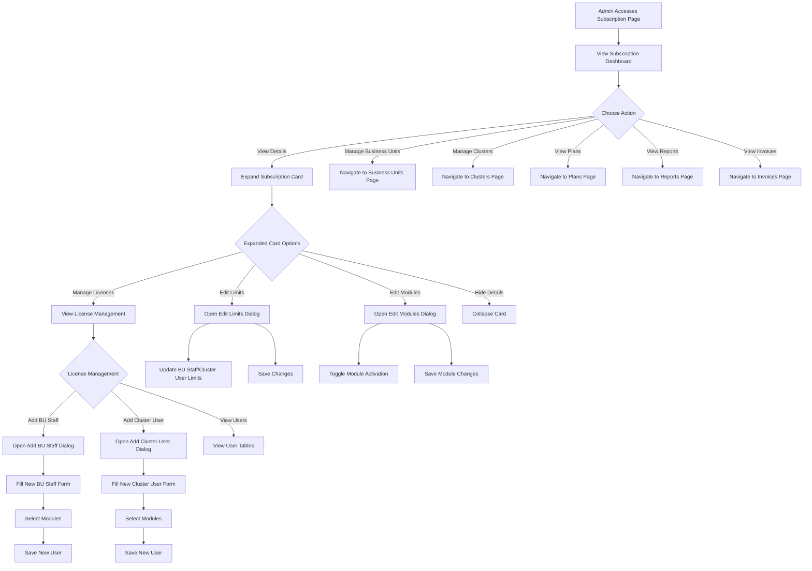
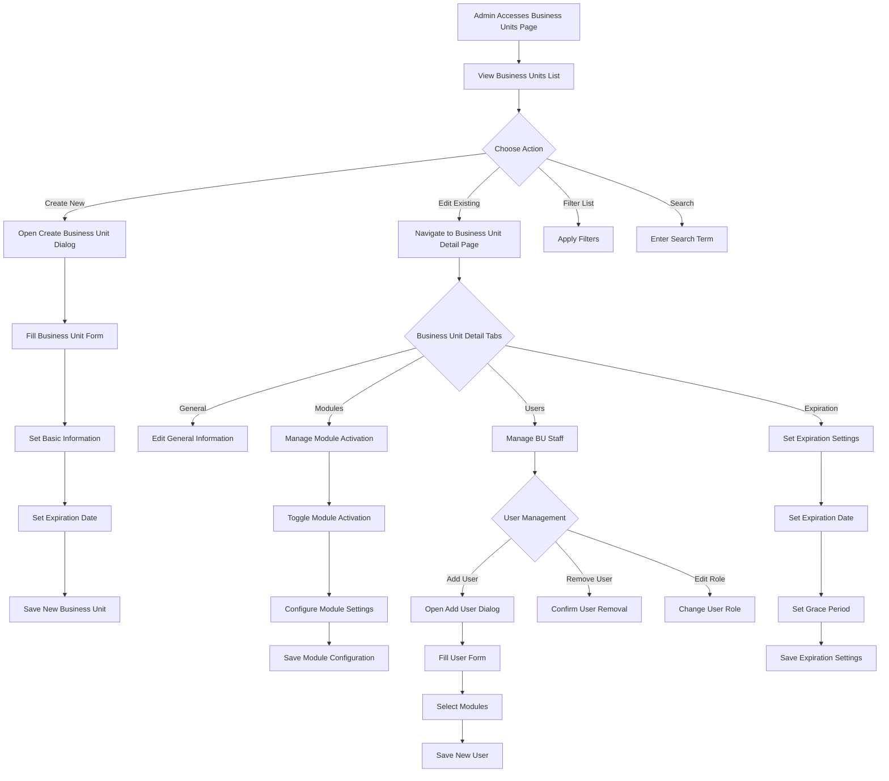
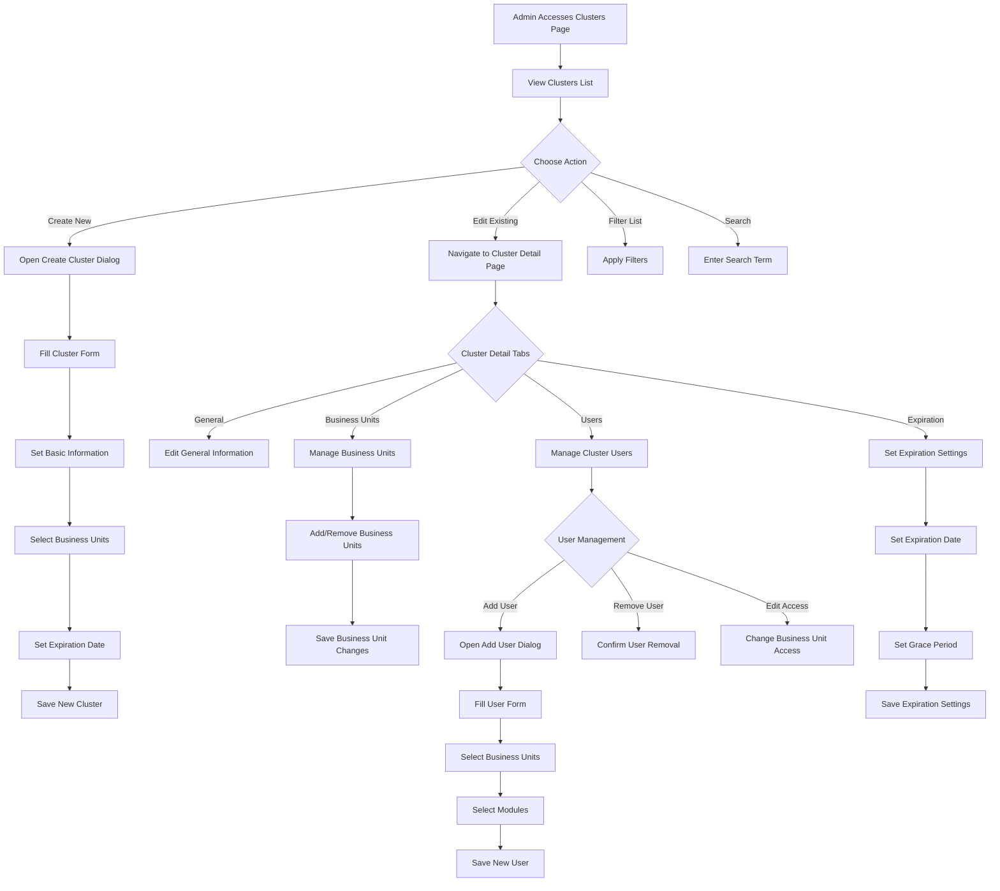
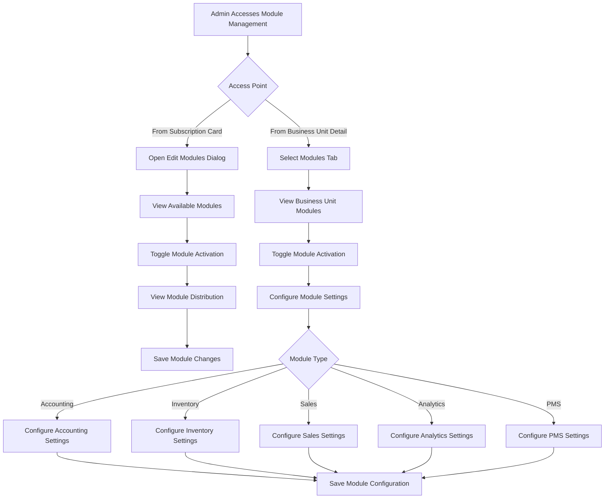
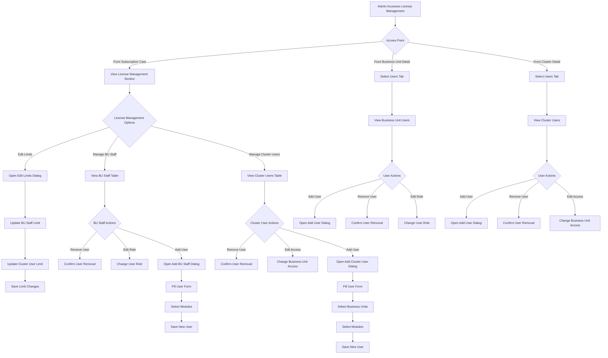
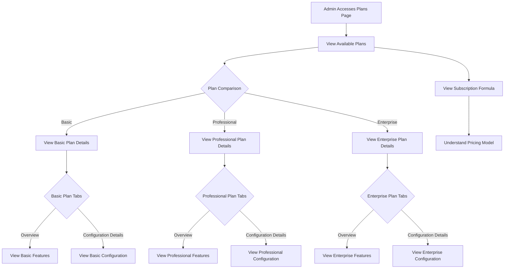
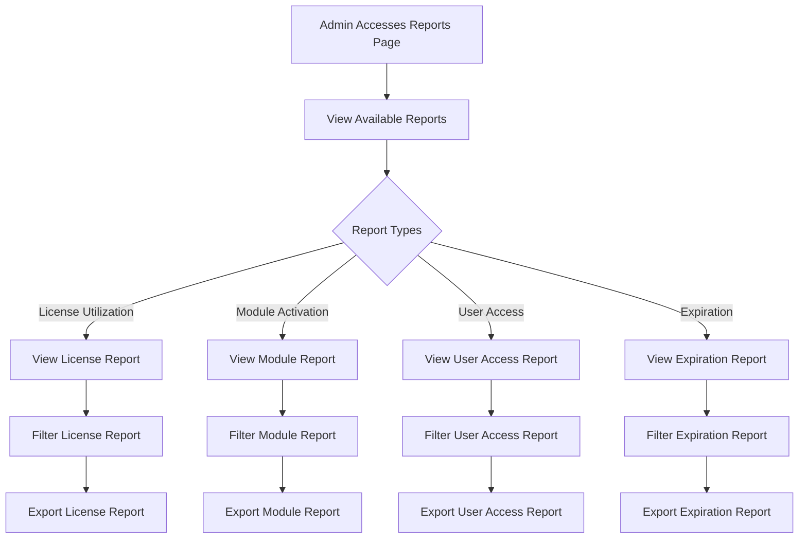
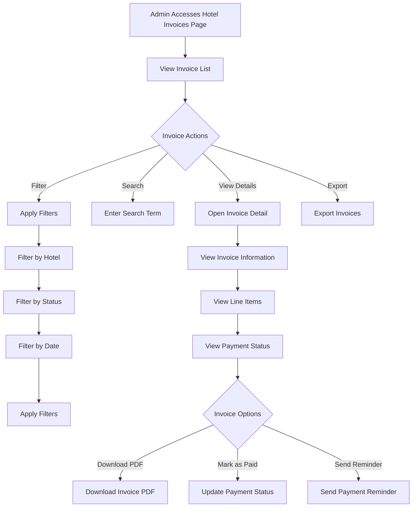
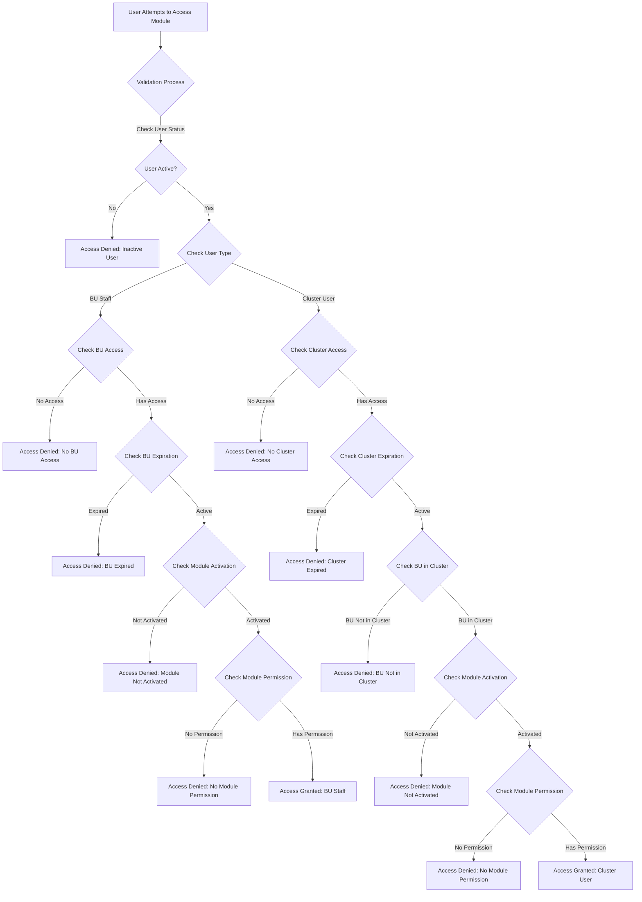
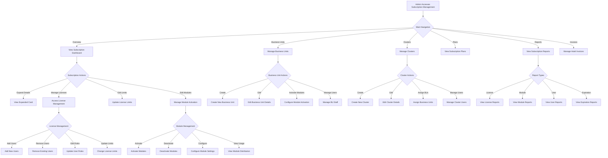

# Subscription Management User Flow Diagram

## 1. Subscription Overview

## 2. Business Unit Management

## 3. Cluster Management

## 4. Module License Management

## 5. License Management

## 6. Subscription Plans

## 7. Subscription Reports

## 8. Hotel Invoices

## 9. License Validation Flow

## 10. Complete Subscription Management Flow

