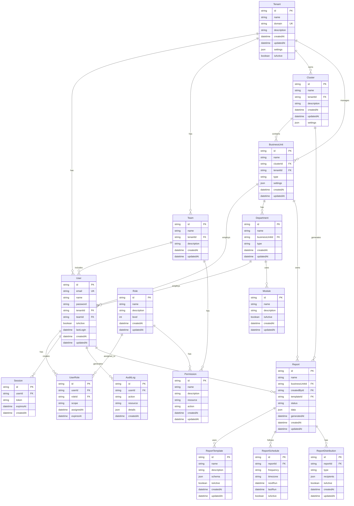

# Carmen Platform Entity Relationship Diagram

## Entity Descriptions

### Core Entities

1. **Tenant**
   - Represents a customer organization
   - Contains global settings and configurations
   - Parent entity for all organization-specific data

2. **Cluster**
   - Represents a group of business units
   - Enables hierarchical organization management
   - Contains cluster-specific settings

3. **BusinessUnit**
   - Represents individual hotels or properties
   - Contains business unit specific configurations
   - Links to departments and users

4. **User**
   - Represents system users
   - Contains authentication information
   - Links to roles and permissions

### Access Control

1. **Team**
   - Organizes users into groups
   - Enables team-based permissions
   - Facilitates resource sharing

2. **Role**
   - Defines user roles in the system
   - Contains role hierarchy information
   - Links to permissions

3. **Permission**
   - Defines granular access controls
   - Specifies allowed actions on resources
   - Supports RBAC implementation

### Operational Entities

1. **Department**
   - Represents business unit departments
   - Contains department-specific settings
   - Links to users and modules

2. **Module**
   - Represents system features/modules
   - Controls feature access
   - Supports modular system architecture

### Reporting System

1. **Report**
   - Represents generated reports
   - Contains report data and metadata
   - Links to templates and schedules

2. **ReportTemplate**
   - Defines report structure
   - Contains template schema
   - Enables standardized reporting

3. **ReportSchedule**
   - Manages automated report generation
   - Contains scheduling information
   - Controls report timing

4. **ReportDistribution**
   - Manages report delivery
   - Contains distribution settings
   - Controls report access

### Security & Audit

1. **Session**
   - Manages user sessions
   - Contains authentication tokens
   - Supports security implementation

2. **AuditLog**
   - Tracks system activities
   - Contains audit trail information
   - Supports compliance requirements

## Key Relationships

1. **Tenant Hierarchy**
   - Tenant → Clusters → Business Units
   - Enables multi-level organization management
   - Supports complex business structures

2. **User Management**
   - User → Teams → Roles → Permissions
   - Implements RBAC
   - Supports flexible access control

3. **Reporting Structure**
   - Report → Template → Schedule → Distribution
   - Enables comprehensive reporting system
   - Supports automated workflows

## Notes

1. All entities include:
   - Unique identifiers (UUID/CUID)
   - Timestamps (created_at, updated_at)
   - Soft delete capability where appropriate

2. Security considerations:
   - Encrypted sensitive data
   - Audit logging for critical operations
   - Session management for security

3. Performance optimizations:
   - Indexed foreign keys
   - Optimized query patterns
   - Efficient relationship structures