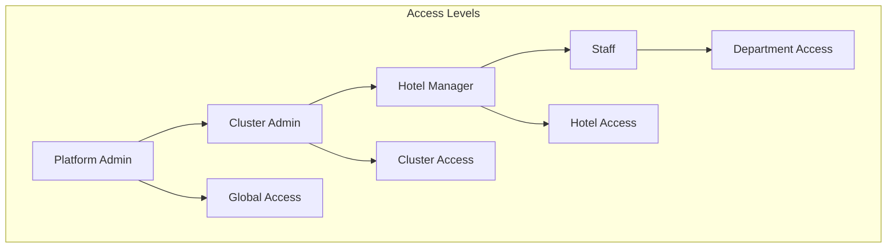
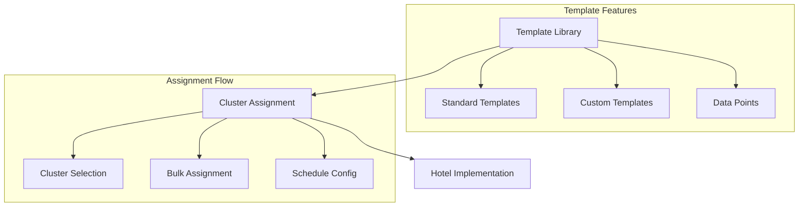
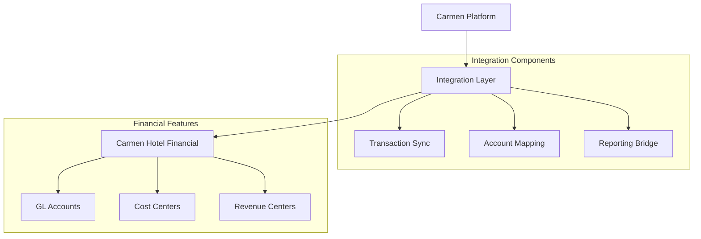
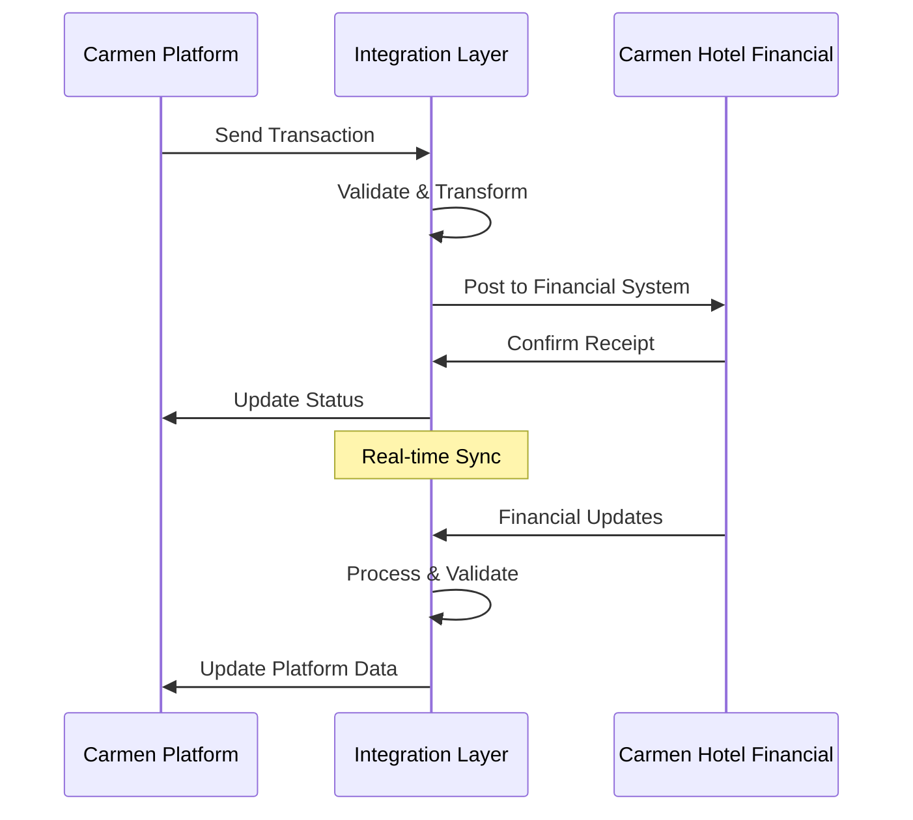

# Carmen Platform Product Requirements Document

## Executive Summary

Carmen-Platform is an enterprise-grade SaaS platform designed to manage and support Supply Chain applications in a multi-tenant environment. The platform provides centralized management, streamlined support workflows, and robust security controls while ensuring complete tenant isolation.

### Key Objectives
- Streamline support and management workflows
- Ensure secure multi-tenant operations
- Provide comprehensive audit and compliance tracking
- Enable customizable reporting and analytics
- Support enterprise-grade scalability

### Target Users
- Platform Administrators
- Cluster Administrators
- Hotel Managers
- Department Staff
- Finance Teams
- Support Teams

## 1. Success Metrics

### 1.1 Performance Metrics
- System Uptime: 99.9%
- API Response Time: < 200ms
- Page Load Time: < 2s
- Concurrent Users: 10,000+

### 1.2 Business Metrics
- Support Resolution Time: -30%
- CSAT Score: >85%
- Self-Service Adoption: +40%
- User Engagement: +50%

## 2. System Architecture

### 2.1 Multi-Tenant Architecture
- Complete tenant isolation at data and application levels
- Hotel group (cluster) based organization
- Tenant-specific configurations and customizations
- Shared infrastructure with isolated resources
- Cross-tenant analytics capabilities (admin only)
- Tenant-level billing and subscription management
- Customizable workflows per tenant
- Data privacy and isolation controls

### 2.2 Security Architecture
- Role-based access control (RBAC)
- Platform and hotel-specific roles
- Multi-factor authentication (MFA)
- Audit logging and compliance tracking
- Data encryption at rest and in transit
- Regular security assessments

### 2.3 User Roles and Permissions

#### Platform Roles

1. **Platform Admin**
   - Global system access
   - User management across all clusters
   - System configuration
   - Template library management
   - Analytics and reporting

2. **Cluster Admin**
   - Hotel group management
   - User management within cluster
   - Report template assignment
   - Cluster-level analytics

3. **Hotel Manager**
   - Hotel-specific management
   - Staff management
   - Report generation
   - Hotel-level analytics

4. **Staff**
   - Department-specific access
   - Report viewing
   - Task execution
   - Basic analytics

### 2.4 Report Management

#### Template System

1. **Template Library**
   - Standard report templates
   - Custom template creation
   - Template categories
   - Data point management
   - Version control

2. **Assignment System**
   - Cluster-level assignment
   - Bulk assignment capabilities
   - Schedule configuration
   - Distribution tracking

3. **Generation System**
   - Automated generation
   - Manual triggers
   - Error handling
   - Distribution management

### 2.5 Integration Architecture

#### Core Integration Features
- RESTful API with versioning
- Webhook support for events
- OAuth2.0 authentication
- Rate limiting and throttling
- API documentation (OpenAPI/Swagger)

#### Carmen Hotel Financial Integration

##### Integration Features
1. **Real-time Transaction Sync**
   - Automated transaction posting
   - Two-way reconciliation
   - Error handling and retry mechanisms
   - Transaction status tracking

2. **Account Mapping**
   - Automated GL account mapping
   - Cost center synchronization
   - Revenue center integration
   - Account validation rules

3. **Financial Reporting**
   - Real-time financial data access
   - Custom report templates
   - Consolidated reporting
   - Audit trail tracking

4. **Security & Compliance**
   - End-to-end encryption
   - Role-based access control
   - Audit logging
   - Compliance reporting

##### Integration Flow

##### Data Synchronization
- **Frequency**: Real-time for critical data, scheduled for non-critical
- **Validation**: Two-way data validation
- **Error Handling**: Automated retry with escalation
- **Monitoring**: Real-time sync status dashboard

## 3. User Interface

### 3.1 Design Principles
- Clean, modern interface
- Responsive design
- Consistent navigation
- Clear hierarchy
- Intuitive workflows

### 3.2 Key Components
- Dashboard with customizable widgets
- Navigation sidebar with role-based menu
- Quick actions
- Search functionality
- Notification system

### 3.3 Accessibility
- WCAG 2.1 compliance
- Keyboard navigation
- Screen reader support
- High contrast mode
- Font size adjustment

## 4. Reporting & Analytics

### 4.1 Report Types
- Financial reports
- Operational reports
- Performance metrics
- Compliance reports
- Custom reports

### 4.2 Analytics Features
- Real-time data processing
- Custom dashboards
- Data visualization
- Export capabilities
- Scheduled reports

## 5. Security & Compliance

### 5.1 Authentication
- Multi-factor authentication
- SSO integration
- Password policies
- Session management

### 5.2 Authorization
- Role-based access control
- Fine-grained permissions
- IP restrictions
- API key management

### 5.3 Audit & Compliance
- Activity logging
- Change tracking
- Compliance reporting
- Data retention policies

## 6. Performance & Scalability

### 6.1 Performance Requirements
- Sub-second response times
- 99.9% uptime
- Automatic scaling
- Load balancing

### 6.2 Monitoring
- Real-time monitoring
- Performance metrics
- Error tracking
- Usage analytics

## 7. Licensing & Subscription

### 7.1 Subscription Tiers
- Basic
- Professional
- Enterprise
- Custom

### 7.2 Feature Matrix
- Core features
- Advanced features
- Add-on modules
- Custom development

### 7.3 Billing
- Usage-based billing
- Monthly/annual plans
- Multi-currency support
- Invoice generation
