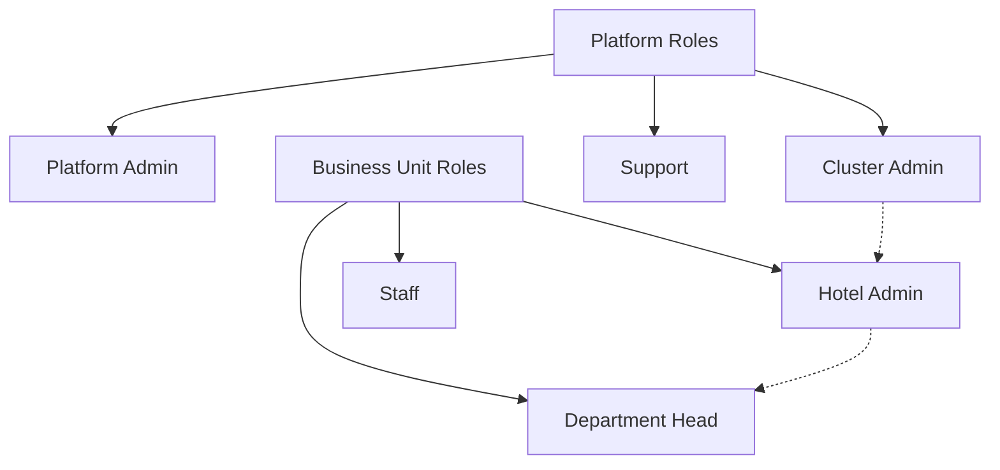
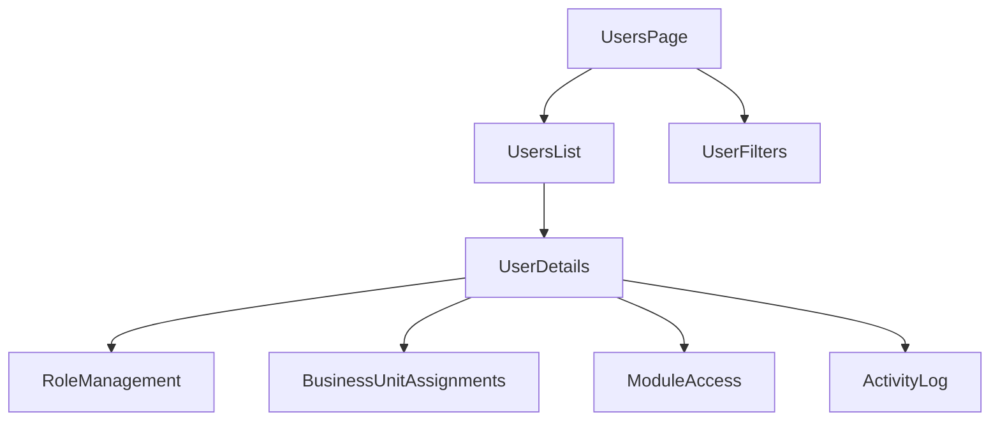
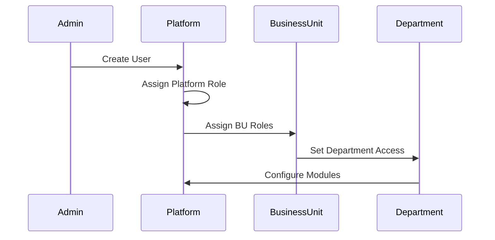
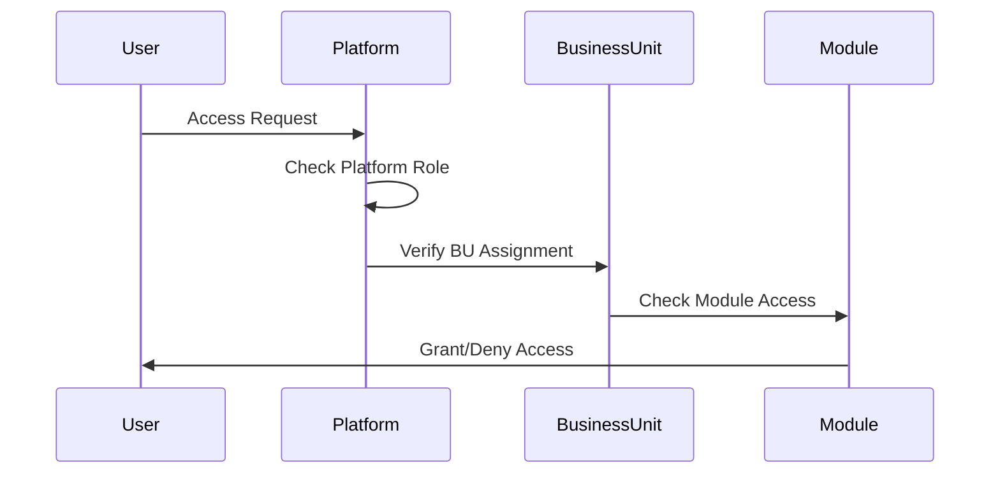

# User Management System

## Overview

The Carmen Platform implements a flexible role-based access control system that supports:
- Platform-wide roles with inheritance
- Multi-role assignments across business units
- Department-specific access control
- Module-based permissions

## Architecture

### Role Hierarchy



### Data Models

```typescript
// Platform Roles
type PlatformRole = 'platform_admin' | 'cluster_admin' | 'support'

// Business Unit Roles
type BusinessUnitRole = 'hotel_admin' | 'department_head' | 'staff'

// Department Types
type Department = 
  | 'front_office'
  | 'housekeeping'
  | 'food_beverage'
  | 'maintenance'
  | 'finance'
  | 'hr'

// Module Access
interface ModuleAccess {
  moduleId: ModuleType
  accessLevel: 'read' | 'write' | 'admin'
}

// Business Unit Assignment
interface BusinessUnitAssignment {
  id: string
  businessUnitId: string
  businessUnitName: string
  role: BusinessUnitRole
  department?: Department
  modules: ModuleAccess[]
  assignedAt: string
  updatedAt: string
}

// User Model
interface User {
  id: string
  name: string
  email: string
  status: 'active' | 'inactive'
  platformRole?: PlatformRole
  businessUnitAssignments: BusinessUnitAssignment[]
  lastActive: string
  createdAt: string
  updatedAt: string
}
```

### Component Structure



## Implementation

### 1. Platform Roles

Platform roles define the highest level of access control:

- **Platform Admin**
  - Full system access
  - Manage platform configurations
  - Access all clusters and business units
  - Configure subscription plans

- **Cluster Admin**
  - Manage specific clusters
  - Configure cluster settings
  - Can be assigned as Hotel Admin
  - Monitor cluster performance

- **Support**
  - Platform-wide read access
  - Access support tools
  - View system status
  - Generate support reports

### 2. Business Unit Roles

Business unit level roles with department-specific access:

- **Hotel Admin**
  - Full hotel management access
  - Manage all departments
  - Assign department roles
  - Full module access within hotel

- **Department Head**
  - Department-specific management
  - Staff assignment
  - Module access within department
  - Report generation

- **Staff**
  - Role-specific access
  - Module-based permissions
  - Task execution
  - Basic reporting

### 3. Multi-Role Support

Users can have multiple roles across different business units:

- Role Combinations
  * Cluster Admin + Hotel Admin
  * Hotel Admin in multiple hotels
  * Department Head across departments
  * Staff with different roles per hotel

- Access Resolution
  * Role inheritance
  * Permission aggregation
  * Conflict resolution
  * Access scope determination

### 4. Module Access Control

Module-based access management:

- Access Types
  * Read
  * Write
  * Admin
  * Custom

- Module Categories
  * Inventory
  * Scheduling
  * Maintenance
  * Reports
  * Finance
  * Procurement

## API Endpoints

### Platform Management
```typescript
POST   /api/users
GET    /api/users/{userId}
PATCH  /api/users/{userId}
DELETE /api/users/{userId}
```

### Business Unit Assignments
```typescript
POST   /api/users/{userId}/business-units
GET    /api/users/{userId}/business-units
PATCH  /api/users/{userId}/business-units/{buId}
DELETE /api/users/{userId}/business-units/{buId}
```

### Module Access
```typescript
POST   /api/users/{userId}/business-units/{buId}/modules
GET    /api/users/{userId}/business-units/{buId}/modules
PATCH  /api/users/{userId}/business-units/{buId}/modules/{moduleId}
```

## Workflows

### 1. User Assignment Flow



### 2. Access Resolution Flow



## Security Considerations

1. Authentication
   - Multi-factor authentication
   - Session management
   - Token validation
   - Access logging

2. Authorization
   - Role-based access
   - Permission validation
   - Resource isolation
   - Audit trails

3. Compliance
   - Data protection
   - Access records
   - Usage tracking
   - Policy enforcement

## Monitoring and Maintenance

1. Usage Tracking
   - Active users
   - Role distribution
   - Module utilization
   - Access patterns

2. Audit Logging
   - Role changes
   - Assignment updates
   - Module access
   - User activities

3. Reporting
   - User statistics
   - Access metrics
   - Usage analytics
   - Compliance reports
